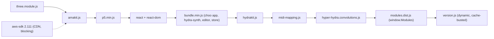

# Hydralisk — Developer Handbook

> Version 0.1 (2026-10-07). Built from the git history (102 commits, 2023-08 → 2026-06) and the current code on `gh-pages`.
> This handbook covers **how things work**. Open issues, ideas, and decisions go in [DEV_NOTEBOOK.md](./DEV_NOTEBOOK.md).

---

## 1. What Hydralisk is

Hydralisk is a fork of Olivia Jack's [Hydra](https://github.com/ojack/hydra) live-coding video synth, tuned for **live-performance playability**:

- **Automutation:** the Hydra mutator runs on a beat-synced timer ("poop mode"), so the visuals keep changing over time (and often drift into black or white-out).
- **Tempo:** tap tempo, a global speed dial, and reverse speed.
- **Scene management:** a sketch library with next/prev/random/search, collections, quick save/load, and autosave history with "jump back".
- **MIDI:** raw CC helpers for sketches (`midi()`, `cc[]`) plus a learnable MIDI-mapping UI for app actions.
- **Editor extras:** format, duplicate line, comment line, fullscreen, hide UI.
- **Rendering extras:** convolution kernels (`blur`, `sharpen`, …), `modulateHue` rewritten as a real color-combine function, and `color('#hex')`.

**Hosting:** GitHub Pages at https://delanni.github.io/hydralisk (branch `gh-pages`, which is the working branch).

### Branches

| Branch | Purpose |
|---|---|
| `gh-pages` | **The code.** It is deployed as-is (no build step for the main app). |
| `master` | Only a README. It is not related to `gh-pages`. |
| `origin/copilot/add-touch-actions-buttons` | Touch HUD controls for `player.js`. Based on `master`, **not merged**. |
| `origin/revert-commit` | Old revert of the three.js attempt. Stale. |

### The big caveat: no upstream source

When the project was forked, the upstream Hydra source didn't build. So **all core changes are made directly in the built browserify bundle, `bundle.min.js`**. The name is misleading: the file is not minified. Commit `99c01639` (2026-02-25) prettier-formatted it to about 79k lines. **No source maps or upstream sources exist in this repo.** Edit the bundle by hand.

---

## 2. Quick start

```bash
npm install          # dev deps only (rollup, babel, serve)
npm start            # serve . → http://localhost:3000
npm run build        # rebuild modules.dist.js (React Sketch Manager) from modules/
npm run watch        # same, in watch mode
```

- The main app is served from the repo root as a static site. `package.json` intentionally has **empty `dependencies`**.
- Routing: in [bundle.min.js:L54-L57](file:///Users/web/Git/hydralisk/bundle.min.js#L54-L57), if the URL contains `github` the choo route is `/hydralisk`; otherwise it is `/`.
- WebMIDI requires a secure context (`localhost` or https) and a Chromium browser.
- Deploy: push to `gh-pages`.

---

## 3. Repository map

| Path | What it is | Edited how |
|---|---|---|
| [index.html](file:///Users/web/Git/hydralisk/index.html) | Main app entry. Loads every script with `defer`, in order. | by hand |
| [bundle.min.js](file:///Users/web/Git/hydralisk/bundle.min.js) | Upstream Hydra editor + hydra-synth browserify bundle, **heavily hacked** | by hand |
| [hydrakit.js](file:///Users/web/Git/hydralisk/hydrakit.js) | Raw WebMIDI → `cc[]`, plus sketch helpers (`midi`, `saw`, `createLFO`, `xxx`, `beatPattern`, `color`, `f`, …) | by hand |
| [midi-mapping.js](file:///Users/web/Git/hydralisk/midi-mapping.js) + [css/midi-mapping.css](file:///Users/web/Git/hydralisk/css/midi-mapping.css) | MIDI-learn modal that maps CC/notes to app events | by hand |
| [amakit.js](file:///Users/web/Git/hydralisk/amakit.js) | AWS DynamoDB client for remote sketches ("drafts") | by hand |
| [hyper-hydra.convolutions.js](file:///Users/web/Git/hydralisk/hyper-hydra.convolutions.js) | Convolution kernel functions registered into Hydra | by hand |
| [modules/](file:///Users/web/Git/hydralisk/modules) → `modules.dist.js` | React (global, UMD) **Sketch Manager** modal | `npm run build` |
| [player.html](file:///Users/web/Git/hydralisk/player.html) / [player.js](file:///Users/web/Git/hydralisk/player.js) / `css/player.css` | Separate "Visual Player" dashboard (vibe-coded 2026-06). Uses `hydra-synth` from unpkg, not the bundle. | by hand |
| [sketches.json](file:///Users/web/Git/hydralisk/sketches.json) | Default public sketch set. Loaded when not logged in to AWS. | `scripts/compile.js` |
| [sketches/](file:///Users/web/Git/hydralisk/sketches) | One-file-per-sketch exploded form of `sketches.json` (`trashbin/` holds rejected ones) | `scripts/explode.js` |
| [scripts/](file:///Users/web/Git/hydralisk/scripts) | `explode.js`, `compile.js`, `encode-credentials.js`, `pre-push.cjs` | — |
| [version.js](file:///Users/web/Git/hydralisk/version.js) | Generated build stamp, loaded with a cache-buster | `pre-push.cjs` |
| `react*.min.js`, `p5.min.js`, `three.module.js` | Vendored libs, loaded as globals | vendored |
| `three.objects.js` | three.js scene helpers. **Not loaded anywhere.** | — |
| `deduplicate.js` | One-off sketch dedupe/filter script | — |
| `sketches_old*.json`, `export0930.json` | Historical sketch dumps | archive |
| `img/`, `*.gif`, `*.mp4`, `*.jpg` | Media for sketches (`s0.initImage(...)` and similar) | assets |
| `infra/`, `infrastructure/pulumis/`, `server/.env` | Empty or placeholder folders. `.env` is git-ignored. | — |

---

## 4. Runtime architecture

### 4.1 Script load order ([index.html](file:///Users/web/Git/hydralisk/index.html))

All scripts use `defer`, so they run **in document order** after parsing:



The choo app's `DOMContentLoaded` handler in the store runs after all deferred scripts have executed. That is why it can use `window.Modules`, `window.amakit`, and the others.

### 4.2 Global contract (`window.*`)

Hydralisk is held together by globals. Treat this table as the API:

| Global | Set by | Used by |
|---|---|---|
| `xemitter` | bundle store (choo `emitter`) | midi-mapping, Sketch Manager, anything that wants to trigger app actions |
| `hydra` / `_hydra` / `_hydraScope` | bundle `Hydra` component / convolutions | convolutions (`setFunction`) |
| `cm` | bundle editor (CodeMirror instance) | debugging |
| `focusEditor()` | bundle store | search box, after closing overlays |
| `bpm` | hydra-synth global; tap tempo writes it | automutate timing, `saw()`, `createLFO({bpm})`, hydra arrays |
| `speed` | hydra-synth global | speed dial, MIDI speed bind |
| `cc[128]`, `ccc[16][128]`, `ccbind[]` | hydrakit | `midi()` helper, sketch code (`() => cc[3]`) |
| `cc.A`…`cc.D` | midi-mapping `midiA..midiD` binds | `midi('A', …)` |
| `amakit` | amakit.js | store (`remote:*`, `gallery:import-remote`), Sketch Manager, player |
| `sketchManager` | store creates `new Modules.SketchManager()` | `gallery:toggleSketchManager`, `hideAll` |
| `midiMapping` | midi-mapping.js (`open/toggle/render/getMapping`) | `midi-mapping:open` |
| `Modules` | modules.dist.js (rollup IIFE) | store |
| `initializeConvolutions` | convolutions | `Hydra` component calls it once after hydra is created |

### 4.3 Navigating `bundle.min.js`

It is a browserify bundle: `{ id: [function(require, module, exports){…}, {deps}] }`. Line numbers change with every edit, so **search by string** (for example `// BOOKMARK: INIT CODE` or an event name). Modules you are likely to touch (positions as of this version):

| Module id | Upstream path (guessed) | Approx. line | Hydralisk relevance |
|---|---|---|---|
| (entry) | `index.js` | ~45 | choo app, `/hydralisk` route switch |
| ~34000–34520 | hydra-synth core / `EvalSandbox` | 34011, 34406 | `speed` and `time` integration (`time += dt*speed`) |
| ~35900 | hydra-synth `glsl-functions` | 35900 | **`modulateHue` changed** from `combineCoord` to an HSV `combine` |
| 258 | `src/stores/gallery.js` | 75340 | `Gallery` class, `saveLocally` (URL pushState) |
| **260** | `src/stores/store.js` | **75747** | **The hub:** memory, hotkey prevention, every custom event handler (§5) |
| 261 | `src/stores/text-elements.js` | 76743 | Info panel text, including the "extra hotkeys" list |
| 262 | `src/views/EditorComponent.js` | 76799 | hide/show the editor on `showUI` |
| 263 | `src/views/Hydra.js` | 76869 | creates `HydraSynth`, sets `window.hydra`, inits convolutions; patchbay `pb.init` disabled |
| 264 | `src/views/editor/editor.js` | 76943 | CodeMirror, keymap → emitter bridge, records `lastCombo`, `formatCode` (js-beautify) |
| **265** | `src/views/editor/keymaps.js` | **77138** | **All hotkeys** |
| **267** | `src/views/editor/randomizer/Mutator.js` | **77221** | Mutation engine |
| 268 | `UndoStack.js` | 77530 | Mutator undo |
| 269 | `randomizer/glslTransforms.js` | 77589 | Function table that the transform swaps choose from |
| 270 | `src/views/editor/repl.js` | 78640 | `eval` wrapper (async IIFE) |
| 271 | `src/views/info.js` | 78672 | Info modal |
| **273** | `src/views/toolbar.js` | **78842** | **Toolbar buttons** |

**Adding a feature usually takes three touches:**
1. Add a handler `emitter.on("ns:action", …)` in module **260**.
2. Optionally bind a hotkey in **265** (`"Shift-Ctrl-X": "ns:action"`).
3. Optionally add a toolbar icon in **273** via `icon(id, "fa-xxx ${hidden}", title, "ns:action", style)`.
4. Optionally make it MIDI-mappable: add an entry to `MAPPABLE_ACTIONS` in [midi-mapping.js](file:///Users/web/Git/hydralisk/midi-mapping.js#L16-L122).

Keyboard dispatch: [editor.js extraKeys](file:///Users/web/Git/hydralisk/bundle.min.js#L76975-L76996) emits `(eventName, editorInstance, key)`. The handler's first argument is then the **editor instance**, which carries `lastCombo`. Toolbar clicks pass the **MouseEvent** instead, so `evt.shiftKey` and `evt.metaKey` work for click modifiers. MIDI passes a **payload object** such as `{ lastCombo: "Shift-Ctrl-3" }` or `{ backwards: true }`. Handlers rely on this duck-typing.

---

## 5. Event bus catalog (`xemitter`)

| Event | Trigger(s) | Effect |
|---|---|---|
| `editor:evalAll` | ▶ button, `Shift-Ctrl-Enter` | eval, flash, `saveLocally` |
| `editor:evalLine` / `editor:evalBlock` | `Ctrl-Enter` / `Alt-Enter` | upstream |
| `editor:formatCode` | `Shift-Ctrl-F` | js-beautify (tabs, chained methods broken) |
| `editor:commentLine` / `editor:duplicateLine` | `Shift-Ctrl-K` / `Cmd-D` | line ops, then re-eval (comment only) |
| `editor:randomize` | 🎲 button, MIDI | one mutation; click+Shift = undo; click+Cmd = transform swap |
| `editor:midify` | — (not bound) | duplicate of randomize (WIP?) |
| `editor:toggleAutomutate` | 💩 button, `Shift-Ctrl-X/0..5`, MIDI | automutate (§6.1) |
| `editor:quickSave` / `editor:quickLoad` | `Cmd-S` / `Cmd-L`, MIDI | single in-memory slot (eval + save first) |
| `editor:jumpBack1` / `editor:jumpBack5` | `Cmd-[` / `Cmd-Shift-[`, MIDI | pop autosave history |
| `editor:clearAll` | 🗑 button | `hush()`, speed=1, clear. With a modifier: delete the current sketch from local storage |
| `gfx:speedSlower/Default/Faster` | `Shift-Ctrl-7/8/9` | step through `[0.01 … 100]` and keep the sign |
| `gfx:speedReverse` | `Shift-Cmd-8`, MIDI | `speed *= -1` |
| `taptempo` | MIDI (legacy: `Alt-Space` in hydrakit) | rolling 4-tap average → `window.bpm` |
| `fullscreen` | `Shift-Ctrl-G`, MIDI | toggle document fullscreen |
| `hideAll` | `Shift-Ctrl-H`, `Cmd-H`, MIDI | toggle `state.showUI` (editor + toolbar opacity) |
| `gallery:nextSketch` / `gallery:prevSketch` | ⏩ button, `Cmd-]` / `Cmd-\`, MIDI | cycle through `mySketches`; index persisted |
| `gallery:randomSketch` | MIDI | random index → next |
| `gallery:loadSketch` | Sketch Manager | load a sketch by name |
| `gallery:search` | 🔍 button, `Shift-Ctrl-C` | datalist autocomplete over sketch names |
| `gallery:saveMyExample` | 💾 button | prompt for a name, upsert into `localStorage.mySketches` |
| `gallery:import` / `gallery:export` | buttons | paste JSON / copy JSON (`window.copy`, DevTools only) |
| `gallery:import-remote` | ⬇ button, auto on empty library | from DynamoDB if logged in, otherwise from `sketches.json` |
| `gallery:updateLocalSketches` | Sketch Manager, collections | replace the in-memory playlist `mySketches` |
| `gallery:toggleSketchManager` | 💼 button, `Cmd-O` | React modal |
| `gallery:saveToURL` | `Shift-Ctrl-L` | upstream URL save |
| `midi-mapping:open` | 🎚 button | MIDI-learn modal |
| `remote:login` / `remote:upload` | 🔑 / ⬆ buttons | amakit login (key turns lime/salmon) / upload the editor text |
| `screencap` | `Shift-Ctrl-S` | screenshot + download the code as `.js` |

---

## 6. Feature deep-dives

### 6.1 Mutation and automutate ("poop mode")

**Mutator** ([module 267](file:///Users/web/Git/hydralisk/bundle.min.js#L77221-L77520)):
1. Parse the editor text with acorn. Collect numeric `Literal`s (skipping strings and numeric member subscripts like `a[0]`) and chained `CallExpression`s (skipping `.out`).
2. Then one of:
   - **Literal glitch** (default): pick one random literal and re-roll it uniformly in `[0, 2 × initialValue]`. The initial value is 0.5 if the original was 0. `initialVector` is captured when the literal count changes. Because values re-roll **relative to the original value**, literals don't accumulate drift.
   - **Transform swap** (`changeTransform`): pick one chained function and replace it with a random function of the **same GLSL type** (`src`, `coord`, `color`, `combine`, `combineCoord`) from `glslTransforms`. One blacklisted pair: `modulate → modulateScrollX`.
3. Regenerate the code with astring (comments are kept), `setValue`, then eval. If the eval errors, retry up to 6 times. The result is pushed to `UndoStack`.

**Automutate** ([store, `editor:toggleAutomutate`](file:///Users/web/Git/hydralisk/bundle.min.js#L75948-L76010)):
- The mode is parsed from the last char of `lastCombo`: `X` toggles (prompting for ms when starting), `0` turns it off, and `1..5` set an interval of 1/2/4/8/16 beats at `60000 / bpm`.
- Every tick: mutate, then `formatCode()`, then `memory.autoSave()`.
- The toolbar 💩 turns **orange** while running.
- ⚠️ The interval is computed **once, at start**. A later tap tempo does not change a running automutate until it is re-triggered.
- ⚠️ `changeTransformChance = 1 - (evt.metaKey ? 0.25 : 0)` and swaps happen when `Math.random() > chance`. From keys or MIDI, automutate is therefore **literal-only**. Transform swaps (25%) only happen when started by Cmd-clicking 💩.

### 6.2 Memory: quick save, autosave, jump back

`memory` object in the store ([L75782](file:///Users/web/Git/hydralisk/bundle.min.js#L75782-L75818)). Everything is **in-memory only** and lost on reload.
- `saveSlot`: one quick-save slot.
- `autoSaves[]`: during automutate, one push **every 8 mutations** (`_autosaveCulling`), plus a forced push at start and on sketch load. `jumpBack(n)` pops n entries and always keeps at least one. History resets on sketch change.

### 6.3 Tempo and speed

- **Tap tempo** (`taptempo` event): needs at least 4 taps, then gives a rolling BPM over the last 4 taps. Taps reset after 5 s idle. It writes `window.bpm`.
- Legacy `Alt+Space` tap in hydrakit: 4 taps, then reset.
- **Speed dial:** steps through `[0.01, 0.05, 0.1, 0.125, 0.25, 1/3, 0.5, 1, 2, 3, 4, 8, 10, 20, 100]` and keeps the sign. Reverse multiplies by -1.
- MIDI `speed` CC bind: `2^(2v) − 1`, so 0 → 0, 0.5 → 1, 1 → 3. The comment in the code says 8, which is wrong.
- hydra-synth integrates `time += dt * speed`, so negative speed runs time backwards.

### 6.4 Scene / sketch management

**Sources (merged by `name`; later sources win):**
1. `sketches.json` (public default set). Fetched when the library is empty and you're not logged in.
2. DynamoDB table `hydralisk-drafts` (eu-west-1) through `amakit`, when authenticated.
3. `localStorage.mySketches` (local edits and imports).

**In-memory playlist:** `mySketches` in the store. Next/prev/random/search operate on it. The Sketch Manager and Collections replace it via `gallery:updateLocalSketches`, so *the active collection = the playlist*.

**Current index:** `localStorage.variables.sketchIdx` is persisted, so reloading resumes the same sketch (2025-10).

**Sketch Manager** (React, [modules/sketchManager/](file:///Users/web/Git/hydralisk/modules/sketchManager)) tabs:
- **This**: edit fields and metadata of the selected sketch; save locally or upload.
- **Sketches**: filter by name and tag, "Keep these" (make the filtered set the playlist), delete, upload (shows a remote badge), clear all.
- **Collections**: named subsets stored in `localStorage.mySketches_collections`. The active collection filters the playlist on load.
- **Import/Export**.

**Sketch object (new format):**
```js
{ id, name, code, fullDraft /* base64 of the full text */, local?, 
  metadata: { author, midi, heat, tags: [] /* + arbitrary keys */ } }
```
When loaded, the editor text is assembled as:
```js
/* <name> */
<code>
/* metadata = {"author":"…","midi":false,"heat":5,"tags":[]} */
```
Old format: `{ name, type: "code"|"url", code|url, bpm, midi, heat, author, index }`. Here the name is the first comment line and `url` holds base64 code.

**localStorage keys:** `mySketches`, `mySketches_collections`, `variables` (`sketchIdx`), `hydra-midi-mapping`, `awsCredentials`, `machineId`.

### 6.5 MIDI

There are two independent layers:

1. **hydrakit (raw values for sketch code)** writes every CC into `cc[ccIndex]` and `ccc[channel][ccIndex]` (normalised to 0–1). It also auto-binds CCs in the order first seen to `b0, b1, …` (`ccbind`). In sketches you use:
   ```js
   osc(midi(3, {min: 10, max: 60}), 0.1).out()
   shape(3).scale(midi('b0', {transform: v => v*v})).out()
   noise(midi('A', {min:1, max:8})).out()        // A–D come from the MIDI mapping modal
   ```
   (Before 2026-03 there were OP-Z color aliases, `midi('green')`, using `{green:0, blue:2, yellow:3, red:4}`. That code path is now an empty branch.)
2. **midi-mapping.js (app control)** offers MIDI-learn: click **Assign**, then move a control (15 s timeout). Mappings are stored in `localStorage["hydra-midi-mapping"]` as `{actionId: {type:'cc'|'note', channel, control|note}}`. Trigger actions fire on CC > 0.5 or on Note On. Bind actions (`speed`, `midiA..D`) receive the value continuously. One control can drive several actions.

⚠️ Both layers set `input.onmidimessage`, and the last assignment wins. See the notebook.

### 6.6 Sketch helper library ([hydrakit.js](file:///Users/web/Git/hydralisk/hydrakit.js))

| Helper | Signature | Notes |
|---|---|---|
| `midi` | `midi(cc \| 'bN' \| 'A'..'D', {min, max, channel, transform})` → `() => number` | §6.5 |
| `saw` | `saw({min, max, x, t})` → `({time}) => …` | BPM-synced ramp, `x` = beats per cycle |
| `createLFO` | `createLFO({frequency, amplitude, phase, waveform, bpm, trans})` | sine/square/sawtooth/triangle/random |
| `randInt(a,b)`, `rx()` | | `rx` ∈ [-0.5, 0.5] |
| `f` | ``f`…` `` → `Function` | function from a template string |
| `xxx(target)` | → `() => number` | eases toward `target` across re-evals, keyed by call site. ⚠️ Chrome stack-format dependent |
| `beatPattern(len, hits, map)` | → `number[]` | random Euclidean-ish pattern for hydra arrays |
| `color('#rrggbb')` / `color(r,g,b)` | → `solid(...)` | |

### 6.7 Rendering additions

- **`modulateHue`** is now a `combine` that shifts `_c0`'s hue by `_c1`'s value × amount (HSV). Upstream it was a coord displacement. This is patched in two places in the bundle.
- **Convolutions** ([hyper-hydra.convolutions.js](file:///Users/web/Git/hydralisk/hyper-hydra.convolutions.js)) is adapted from hyper-hydra. It generates GLSL from kernels (`sharpen`, `sharpenMore`, `lineSharpen`, `emboss`, `blur`, `blur5`, `blur7`, `boxBlur`, `boxBlur5`, …) with Regular / Luma / Y / UV / IQ variants. It is registered once via `window.initializeConvolutions()` from the Hydra component.
- **three.js:** `three.module.js` (UMD build, ~1.2 MB) is loaded on every page. `three.objects.js` (scene, cube, orbital helpers) isn't wired in. The first attempt (2024-12) was reverted.
- Patchbay / WebRTC (`pb.init`) is disabled, and the info modal is hidden by default.

### 6.8 Remote storage (amakit)

- DynamoDB is accessed **directly from the browser**: aws-sdk v2.111 from the CDN, `DocumentClient`, full-table `scan`.
- Login: `prompt()` for name and access key/secret, verified through `AWS.config.credentials.get`, then saved to `localStorage.awsCredentials`.
- There is an **encrypted-credentials** path: [encode-credentials.js](file:///Users/web/Git/hydralisk/scripts/encode-credentials.js) (PBKDF2 + AES-GCM), `window.awsCredentialsEncoded`, `_decryptSecret`, and `saveEncodedCredentials`. It is **not used by `login()`**. Commit `09bf6b96` ("fix saving credentials, old way") went back to plain prompts.

### 6.9 Visual Player ([player.html](file:///Users/web/Git/hydralisk/player.html))

A standalone dashboard: library with tag filters, now-playing, BPM / tap tempo, automutate modes with its own mutation history (undo/redo), a custom-code tab, a volume meter, and cloud login. It loads `hydra-synth` from unpkg (**unpinned**) and reuses amakit, hydrakit, midi-mapping, and convolutions. **It reimplements the mutator** in `mutateCode()` instead of sharing module 267.

---

## 7. Hotkeys (source of truth: keymaps, [module 265](file:///Users/web/Git/hydralisk/bundle.min.js#L77138-L77187))

| Keys | Action |
|---|---|
| `Shift-Ctrl-Enter` / `Ctrl-Enter` / `Alt-Enter` | eval all / line / block |
| `Shift-Ctrl-F` | format code |
| `Ctrl-/`, `Shift-Ctrl-K` | toggle comment (CM) / comment line (custom) |
| `Cmd-D` | duplicate line |
| `Cmd-S` / `Cmd-L` | quick save (+eval) / quick load |
| `Cmd-[` / `Cmd-Shift-[` | jump back 1 / 5 autosaves |
| `Shift-Ctrl-X` | automutate toggle (prompts for ms) |
| `Shift-Ctrl-0..5` | automutate off / every 1, 2, 4, 8, 16 beats |
| `Shift-Ctrl-7/8/9` | speed slower / 1 / faster |
| `Shift-Cmd-8` | reverse speed |
| `Cmd-]` / `Cmd-\` | next / previous sketch |
| `Shift-Ctrl-C` | search sketches |
| `Cmd-O` | Sketch Manager |
| `Shift-Ctrl-H`, `Cmd-H` | hide/show UI |
| `Shift-Ctrl-G` | fullscreen |
| `Shift-Ctrl-S` | screencap + download code |
| `Shift-Ctrl-L` | save to URL |
| `Alt-Space` ×4 | tap tempo (hydrakit, legacy) |

Browser defaults are suppressed for `Cmd-H/Q/[/O/P/S/W/T/N/M/A` ([L75824](file:///Users/web/Git/hydralisk/bundle.min.js#L75824-L75860)).
> The `master` README and the in-app info text are partly out of date (for example "CTRL+(1..5)" and "every 10 automutates"). Keymaps are authoritative.

---

## 8. Tooling and release

| Script | Purpose |
|---|---|
| `node scripts/explode.js` | `sketches.json` → `sketches/<Name>.js` (name comment + code + `/* metadata = … */`) |
| `node scripts/compile.js` | `sketches/*.js` → `sketches.json`, re-indexed (`trashbin/` is ignored) |
| `npm run encode-credentials` | produce an encrypted AWS credential blob |
| `scripts/pre-push.cjs` | refuses dirty trees and stamps `version.js` with the last commit msg + sha (amends). **Not installed** in `.git/hooks` at the moment. |
| `npm run build` | rollup: `modules/modules.js` → `modules.dist.js` (IIFE, `window.Modules`), babel-preset-react, postcss injects CSS |

The release process is simply: commit, then push `gh-pages`. Pages serves it. `version.js` is printed to the console on load (`VERSION {…}`).

---

## 9. History: how we got here

| Period | Theme | Highlights |
|---|---|---|
| 2023-08 | Fork and first hacks | `/hydralisk` basepath, patchbay off, import/export, `sketches.json`, next/prev/random buttons, **automutate v1**, OP-Z color MIDI, `saw()` |
| 2023-12 | Tooling | explode/compile sketches, `version.js` + pre-push saga, `Ctrl-Shift-X` automutate, `Ctrl-Shift-C` search, index kept after search |
| 2024-02 → 05 | Editor and playability | duplicate/comment line, `Cmd-S` save+exec, `createLFO`, **poop mode 0–5 tiers**, autosave + jump back, ``f`` ``, `xxx()`, `beatPattern()`, **amakit/DynamoDB**, metadata format |
| 2024-07 → 11 | Polish | strings never glitched, orange poop indicator, autosave every 8, **speed dial**, fullscreen/format keys, `color('#hex')`, `modulateHue` rewrite, default set when logged out |
| 2024-12 → 2025-01 | Experiments | three.js support (reverted), dancing cat, images |
| 2025-05 | Modules | rollup + React **Sketch Manager v1**, "keep only filtered" |
| 2025-10 | Continuity | reload resumes the current sketch, `Cmd-\` goes back |
| 2026-02 → 03 | **MIDI and scenes** | MIDI-mapping module, collections, simpler login, random sketch, multi-action MIDI, tap tempo / hide / fullscreen as events, **convolutions**, three.js again, `midi('A'..'D')` |
| 2026-06 | Player | `player.html` dashboard, rabbit images, credentials revert |

---

## 10. Conventions (de facto)
These are de-facto as an artifact of having to hack to the bundle without rebuilding,
many of these should and will be solved in the future, so do not treat them as fix or given, treat them as artifacts to be solved.

- Upstream code in the bundle stays in place. Add hacks next to it, in the same style, and mark with `// TODO`/`// BOOKMARK`.
- New cross-cutting features go through **`xemitter` events** rather than direct calls. That keeps them bindable to keys, buttons, and MIDI.
- Prefer **separate top-level files** (like hydrakit, midi-mapping, convolutions) or **`modules/`** (React, built) over growing the bundle.
- No runtime npm dependencies. Vendor or CDN only.
- Sketch identity is the **name** (merge and dedupe by name). `id` is only reliable for remote drafts.
